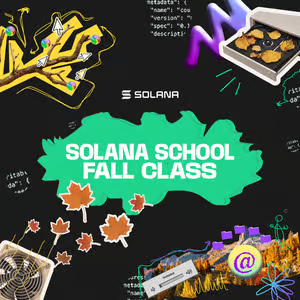

# Solana School: Fall Class


This repository is my workspace for **Solana School: Fall Class** — seven weeks of hands-on Solana learning and building.

The program runs from **August 31 to October 16, 2026**, with 1.5-hour sessions every Monday, Wednesday, and Friday. It combines live program development, independent challenges, group debugging, guest lectures, and office hours with Solana Foundation DevRel.

## What I’m learning

- Solana architecture, program accounts, PDAs, and developer tooling
- Anchor programs, including vault and escrow projects
- Token-2022 and transfer hooks
- Native Rust with Pinocchio and compute-unit optimization
- Metaplex, Codama, and client generation
- Geyser indexing and real-time data streams
- Demo-day presentation and Colosseum preparation

## Repository structure

Each class exercise or project lives in its own directory. This keeps the course work organized as a single monorepo while each project remains independently runnable.

```text
.
├── hello_solana/    # Introductory Anchor program and PDA exercises
└── README.md